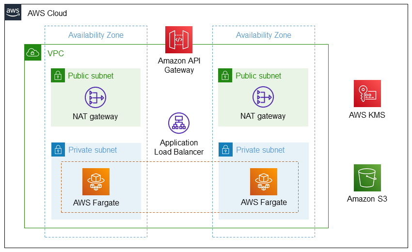

# CI/CD pipeline to deploy microservices with AWS Fargate and Amazon API Gateway

## Summary
Traditionally, building a modern application involves decoupling and optimizing business logic into a microservices architecture to reduce complexity and to improve speed and alignment. APIs, which abstract communications among services, are the foundation of microservices. Having a CI/CD pipeline for deploying microservices and APIs can accelerate the development of modern applications and help maintain system stability and security.

This sample includes AWS CloudFormation templates and Python code to automate steps for the pattern "Create a CI/CD pipeline to deploy microservices with AWS Fargate and Amazon API Gateway," and also includes a sample application. The pattern uses AWS Fargate to provision compute resources for microservices and Amazon API Gateway to manage the APIs that handle communications among the microservices efficiently. The CI/CD pipeline is set up by implementing three AWS services: AWS CodePipeline, AWS CodeBuild, and AWS CodeDeploy. 

### Objectives
- Use the flexibility provided by AWS Fargate to run microservices.
- Expose these microservices by using Amazon API Gateway.
- Create a CI/CD pipeline to deploy new microservices, using Amazon API Gateway.

### Architecture

#### Technology Stack
- Code: Python
- Repository: AWS CodeCommit
- Pipeline: AWS CodePipeline + AWS CodeBuild + AWS CodeDeploy
- Computional resource: AWS Fargate

## Full Guide

